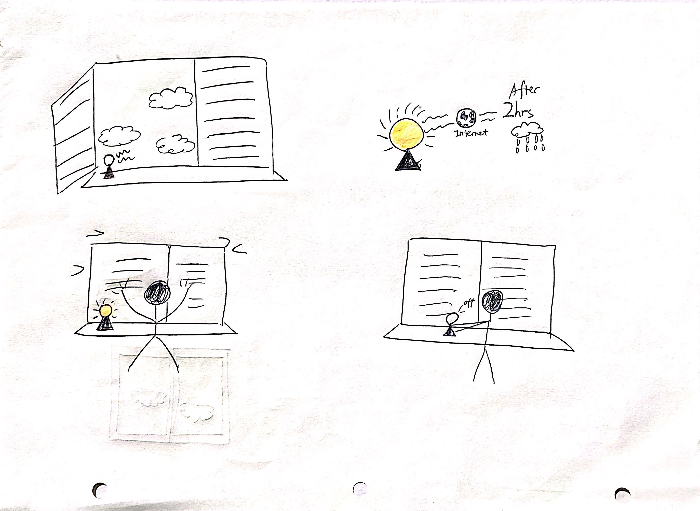
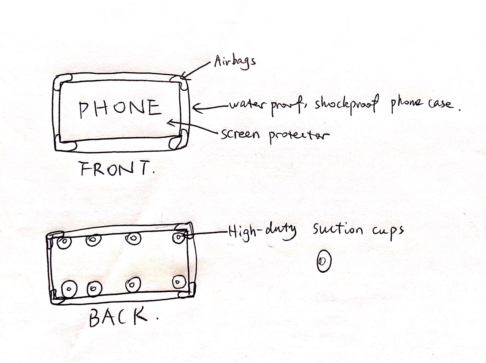

# Staging Interaction

In the original stage production of Peter Pan, Tinker Bell was represented by a darting light created by a small handheld mirror off-stage, reflecting a little circle of light from a powerful lamp. Tinkerbell communicates her presence through this light to the other characters. See more info [here](https://en.wikipedia.org/wiki/Tinker_Bell). 

There is no actor that plays Tinkerbell--her existence in the play comes from the interactions that the other characters have with her.

For lab this week, we draw on this and other inspirations from theatre to stage interactions with a device where the main mode of display/output for the interactive device you are designing is lighting. You will plot the interaction with a storyboard, and use your computer and a smartphone to experiment with what the interactions will look and feel like. 

_Make sure you read all the instructions and understand the whole of the laboratory activity before starting!_

## Prep

### To start the semester, you will need:
1. Set up your own Github "Lab Hub" repository to keep all you work in record by [following these instructions](https://github.com/FAR-Lab/Developing-and-Designing-Interactive-Devices/blob/2021Fall/readings/Submitting%20Labs.md).
2. Set up the README.md for your Hub repository (for instance, so that it has your name and points to your own Lab 1) and [learn how to](https://guides.github.com/features/mastering-markdown/) organize and post links to your submissions on your README.md so we can find them easily.
3. (extra: Learn about what exactly Git is from [here](https://git-scm.com/book/en/v2/Getting-Started-What-is-Git%3F).)

### For this lab, you will need:
1. Paper
2. Markers/ Pens
3. Scissors
4. Smart Phone -- The main required feature is that the phone needs to have a browser and display a webpage.
5. Computer -- We will use your computer to host a webpage which also features controls.
6. Found objects and materials -- You will have to costume your phone so that it looks like some other devices. These materials can include doll clothes, a paper lantern, a bottle, human clothes, a pillow case, etc. Be creative!

### Deliverables for this lab are: 
1. Storyboard
1. Sketches/photos of costumed device
1. Any reflections you have on the process
1. Video sketch of the prototyped interaction
1. Submit the items above in the lab1 folder of your class [Github page], either as links or uploaded files. Each group member should post their own copy of the work to their own Lab Hub, even if some of the work is the same from each person in the group.

### The Report
This README.md page in your own repository should be edited to include the work you have done (the deliverables mentioned above). Following the format below, you can delete everything but the headers and the sections between the **stars**. Write the answers to the questions under the starred sentences. Include any material that explains what you did in this lab hub folder, and link it in your README.md for the lab.

## Lab Overview
For this assignment, you are going to:

A) [Plan](#part-a-plan) 

B) [Act out the interaction](#part-b-act-out-the-interaction) 

C) [Prototype the device](#part-c-prototype-the-device)

D) [Wizard the device](#part-d-wizard-the-device) 

E) [Costume the device](#part-e-costume-the-device)

F) [Record the interaction](#part-f-record)

Labs are due on Mondays. Make sure this page is linked to on your main class hub page.

## Part A. Plan 

To stage the interaction with your interactive device, think about:

_Setting:_ Where is this interaction happening? (e.g., a jungle, the kitchen) When is it happening?

_Players:_ Who is involved in the interaction? Who else is there? If you reflect on the design of current day interactive devices like the Amazon Alexa, it’s clear they didn’t take into account people who had roommates, or the presence of children. Think through all the people who are in the setting.

_Activity:_ What is happening between the actors?

_Goals:_ What are the goals of each player? (e.g., jumping to a tree, opening the fridge). 

The interactive device can be anything *except* a computer, a tablet computer or a smart phone, but the main way it interacts needs to be using light.

\*\***Describe your setting, players, activity and goals here.**\*\

Setting: this interaction can happen in any indoor places with a window. Although the device fetches information all the time from Internet, it only interacts with human when there will be a rain. 

Players: the room owner is involved. Nobody else is affected by this interaction.

Activity: When the device finds out a storm or a rain is coming in the next two hours, it lights up to notify the room owner to close the windows.

Goals: The goal of this device is to forcast bad weather, reminds the user taking a proper action to avoid water damage to his or her belongings near the window.  

Sketch a storyboard of the interactions you are planning. It does not need to be perfect, but must get across the behavior of the interactive device and the other characters in the scene. 

\*\***Include a picture of your storyboard here**\*\*

Present your idea to the other people in your breakout room. You can just get feedback from one another or you can work together on the other parts of the lab.

\*\***Summarize feedback you got here.**\*\*
Three classmates said this is a good idea, given the fact the recent rain in midnight damaged many homes. One of them felt 2 hours forecasting is too long and the system should report the weather in the next hour, and the resource of weather information should be reliable.

## Part B. Act out the Interaction

Try physically acting out the interaction you planned. For now, you can just pretend the device is doing the things you’ve scripted for it. 

\*\***Are there things that seemed better on paper than acted out?**\*\*
Putting the device on the windowsill is troublesome since the user need to put it on another surface or hold it while closing the window so it doesn't get in the way, and manually turning the light off after closing the window seems a bit redundant. 

\*\***Are there new ideas that occur to you or your collaborators that come up from the acting?**\*\*
Instead of having the light on windowsill, I should integrated it to the window to make the windowsill neater, and the light should automatically detect if the window is closed so the user don't necessarily switch the light off. 

## Part C. Prototype the device

You will be using your smartphone as a stand-in for the device you are prototyping. You will use the browser of your smart phone to act as a “light” and use a remote control interface to remotely change the light on that device. 

Code for the "Tinkerbelle" tool, and instructions for setting up the server and your phone are [here](https://github.com/FAR-Lab/tinkerbelle).

We invented this tool for this lab! 

If you run into technical issues with this tool, you can also use a light switch, dimmer, etc. that you can can manually or remotely control.

\*\***Give us feedback on Tinkerbelle.**\*\*
It works on my devices and the documentation is well-written. 

## Part D. Wizard the device
Take a little time to set up the wizarding set-up that allows for someone to remotely control the device while someone acts with it. Hint: You can use Zoom to record videos, and you can pin someone’s video feed if that is the scene which you want to record. 

\*\***Include your first attempts at recording the set-up video here.**\*\*
https://drive.google.com/file/d/1NTYpSybUqAkA5c-llj0MOQHYu3W6M_kT/view?usp=sharing

Now, hange the goal within the same setting, and update the interaction with the paper prototype. 

\*\***Show the follow-up work here.**\*\*
After testing with different positions of the light with paper prototype, I think putting the light on the bottom of the inner window frame makes it more visible for the users.
Interaction with paper prototype: https://drive.google.com/file/d/1GKfZ-Q2vSYCNcCQ_f0KDHwVYbMhUIE34/view?usp=sharing

## Part E. Costume the device

Only now should you start worrying about what the device should look like. Develop a costume so that you can use your phone as this device.

Think about the setting of the device: is the environment a place where the device could overheat? Is water a danger? Does it need to have bright colors in an emergency setting?

\*\***Include sketches of what your device might look like here.**\*\*

\*\***What concerns or opportunitities are influencing the way you've designed the device to look?**\*\*
This device needs to be fixed on the inner side of a window. There's a risk that the device may fall down and get water damage. So a firm case for the phone is required. A set of high duty suction cups should be attached to the back of the case so it stays on the window frame. However, the best appearance of this device is a tiny bright light integrated into the inner window frame. 

## Part F. Record

\*\***Take a video of your prototyped interaction.**\*\*
I don't have a case with suction cups, so I used tapes for this video. 
https://drive.google.com/file/d/1rYPGuyA_Cyolek6N5H6U5vs0-WIPC_7c/view?usp=sharing

\*\***Please indicate anyone you collaborated with on this Lab.**\*\*
I worked alone on this project and didn't refer to any resources. Peer feedbacks were offered by Kaiyuan Deng, Angela Chen, and Esther Fang.

# Staging Interaction, Part 2 

This describes the second week's work for this lab activity.

## Prep (to be done before Lab on Wednesday)

You will be assigned three partners from another group. Go to their github pages, view their videos, and provide them with reactions, suggestions & feedback: explain to them what you saw happening in their video. Guess the scene and the goals of the character. Ask them about anything that wasn’t clear. 

\*\***Summarize feedback from your partners here.**\*\*

Ruby Pan, Jenny Li, and Ruoyu Zhou gave me some good feedback. They all suggested that I could use different color of lights to show how heavy the incoming rain is. And one of them would like to see the light integrated into the window frame as a decoration. 

## Make it your own

Do last week’s assignment again, but this time: 
1) It doesn’t have to (just) use light, 
2) You can use any modality (e.g., vibration, sound) to prototype the behaviors! Again, be creative!
3) We will be grading with an emphasis on creativity. 

\*\***Document everything here. (Particularly, we would like to see the storyboard and video, although photos of the prototype are also great.)**\*\*

The setting is the same as the previous version: the device can inform the user if there will be a rain in the next 30 mins, and the user can decide if he or she needs to close the window. 
Given the peer feedback, I improve the design to use different color (a color scheme) to forecast how strong the rain is. 

Storyboard

New ideas during acting out:
Instead of fixing the device to the window, I can make this device to be a decoration and hang it on the window frame. 
In the case of an incoming mild rain that the user doesn't need to close the window, the device blinks dimly. And the user can manually turn it off rather than close the window. 

Costume the device:

